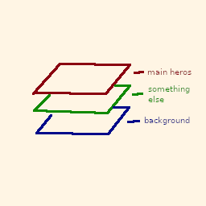

# Documentation
This is a very very small documentation, because the crate hasn't a lot of methods or any difficult structs.
And I'm begin from a main of this - struct Field. In fact there is a only one struct in crate, which has all methods to work.
## Layers
I shall set layers as a enumerate or struct, but now there is a only two-level vector with chars.
Layer is a canva with specified width & height. meaning of layers is a highing easy to edit canva, for example you do the game and you need everyone "mainloop" iteration draw in first background, then other static thing, then main heros, but with layers you can make a background and never touch to that. So it is show like that:



Cool? - Yes.
The Field has a property "seq" (sequence), that need for collect your layers, I descript all later, only collect your layers here.
Declare Field type:
```Rust
let mut field = Field {
	x: usize, 
	y: usize, 
	default_char: char, 
	seq: Vec<Vec<Vec<char>>>
};
```
default_char is a property for char, which will be as opacity, I recommend use space (' ') or dot ('.'), but you can specify, what you want.
Then, let create a first layer
```Rust
let mut bg = field.build_layer();
```
Don't move argument, you specify all in past. Build_layer will make Vec<Vec<char>> with default_char.
Let's drawing! function horizontal from Fieid, create a horizontal line, we can use method 'line', but if you know, what it is 100% will a horizontal - don't use line, it has slower algoritm then 'horizontal' or 'vertical'.
```Rust
bg = field.horizontal(x:[usize, usize], y:usize, char:char);
```
and pushing(yes, while with move, I promise in version 0.1.6 you will use links):
```Rust
field.seq.push(bg);
```
In progress...